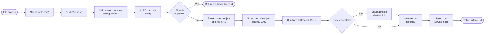
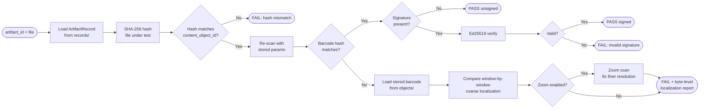
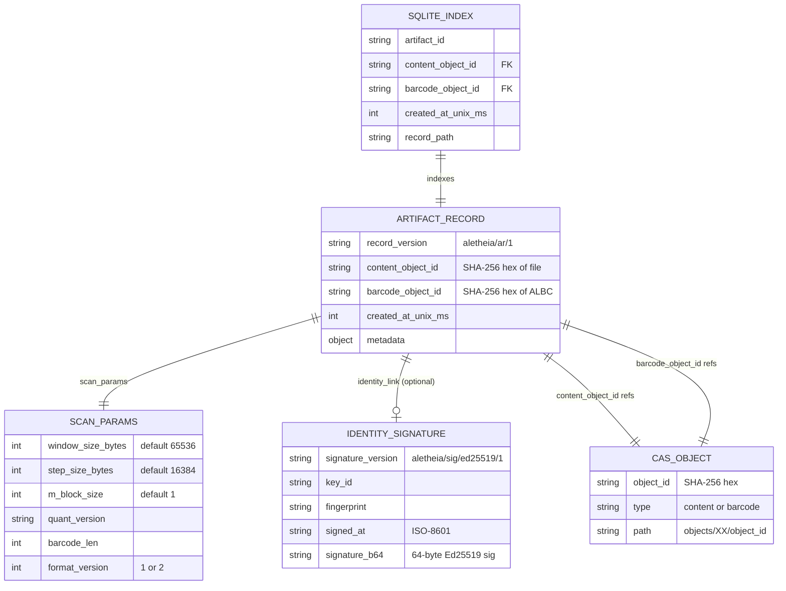

# Aletheia Repository

Content-addressed storage with entropic barcode verification for forensic-grade file integrity.

## Overview

Aletheia provides cryptographic and forensic verification of files through:

1. **Cryptographic Identity**: SHA-256 content hashing
2. **Forensic Identity**: Entropy-based "barcode" signatures that detect modifications and localize changes
3. **Identity Link**: Optional Ed25519 digital signatures binding artifacts to analyst identities

## How It Works

### Ingest



### Verify



## Installation

```bash
# 1. Install editable package and CLI entrypoint
pip install -e .

# 2. Compile the Odin entropy scanner
odin build odin_entropy/entropy.odin -file -o:speed -out:odin_entropy/entropy.exe

# 3. (Optional) Install cryptography for digital signatures
pip install cryptography

# 4. Initialize repository (auto-created on first ingest)
aletheia ingest <any-file>
```

## Quick Start

```bash
# Ingest a file
aletheia ingest document.pdf

# Verify the file later
aletheia verify <artifact_id> --file document.pdf

# List all artifacts
aletheia list

# Run integrity audit
aletheia audit
```

For an interview-friendly end-to-end walkthrough, see [`PORTFOLIO_DEMO.md`](PORTFOLIO_DEMO.md).

## Commands

### `aletheia ingest <file>`

Ingest a file into the repository with entropy barcode generation.

```bash
aletheia ingest example.pdf
aletheia ingest example.pdf --window 65536 --step 16384 --m 1
aletheia ingest large_video.mp4 --threads 8

# With digital signature
aletheia ingest evidence.pdf --sign analyst-alice --passphrase

# High-precision mode (stores raw f64 entropy values for forensic zoom)
aletheia ingest evidence.pdf --format 2
```

**Options:**

| Option             | Description                                            |
| ------------------ | ------------------------------------------------------ |
| `--window <bytes>` | Entropy window size (default: 65536 / 64KB)            |
| `--step <bytes>`   | Step size between windows (default: 16384 / 16KB)      |
| `--m <1\|2>`       | Block size for entropy calculation (default: 1)        |
| `--threads <N>`    | Thread count for parallel scanning (default: auto)     |
| `--format <1\|2>`  | ALBC format version (1=quantized, 2=quantized+raw f64) |
| `--repo <path>`    | Repository root directory (default: .)                 |
| `--no-auto-init`   | Don't auto-initialize repository                       |
| `--quiet`          | Suppress verbose output                                |
| `--keep-temp`      | Keep temporary .albc barcode file                      |
| `--sign <key_id>`  | Sign artifact with specified key                       |
| `--passphrase`     | Prompt for key passphrase                              |

**Format Versions:**

- **Format 1 (default)**: Stores quantized u8 entropy values (1 byte per window). Suitable for most use cases.
- **Format 2**: Stores both quantized u8 AND raw f64 entropy values. Required for sub-quantization precision during forensic zoom scans. Larger file size but detects changes below the u8 quantization threshold (Δ < 0.001 entropy).

**Idempotent**: Re-ingesting the same file with identical parameters produces the same artifact ID.

### `aletheia verify <artifact_id> --file <path>`

Verify a file against a stored artifact with three independent checks:

```bash
aletheia verify abc123... --file document.pdf
aletheia verify abc123... --file document.pdf --no-zoom
```

**Verification Checks:**

1. **Cryptographic**: `SHA-256(file) == content_object_id`
2. **Forensic**: Recompute barcode, compare to `barcode_object_id`
3. **Identity Link**: Verify Ed25519 signature (if present)

**Options:**

| Option          | Description                                  |
| --------------- | -------------------------------------------- |
| `--file <path>` | File to verify (required)                    |
| `--repo <path>` | Repository root (default: .)                 |
| `--quiet`       | Suppress verbose output                      |
| `--no-zoom`     | Disable zoom scan (coarse localization only) |
| `--require-signature` | Require valid identity signature (fails if missing/invalid) |

**Zoom Scan**: When forensic check fails, automatically performs high-resolution analysis on modified regions (8√ó finer than baseline) to precisely localize changes. If the baseline was ingested with `--format 2`, zoom scan uses raw f64 comparison for sub-quantization precision.

### `aletheia show <artifact_id>`

Display detailed artifact information.

```bash
aletheia show abc123def456...
```

### `aletheia list`

List recent artifacts with scan parameters.

```bash
aletheia list
aletheia list --limit 100
```

### `aletheia identity <subcommand>`

Manage signing keys for identity links.

```bash
# Generate a new signing key
aletheia identity generate analyst-alice --name "Alice Smith" --email alice@example.com

# Generate with passphrase protection
aletheia identity generate analyst-bob

# List available keys
aletheia identity list

# Export public key for distribution
aletheia identity export analyst-alice > alice-public.json

# Import a public key from colleague
aletheia identity import colleague-public.json
```

**Subcommands:**

| Subcommand          | Description                          |
| ------------------- | ------------------------------------ |
| `generate <key_id>` | Generate new Ed25519 signing keypair |
| `list`              | List all available keys              |
| `export <key_id>`   | Export public key as JSON            |
| `import <file>`     | Import a public key                  |

**Key Generation Options:**

| Option            | Description                      |
| ----------------- | -------------------------------- |
| `--name <name>`   | Key owner name                   |
| `--email <email>` | Key owner email                  |
| `--org <org>`     | Organization                     |
| `--passphrase`    | Prompt for encryption passphrase (default) |
| `--no-passphrase` | Store private key unencrypted (not recommended) |

### `aletheia diff <file1.albc> <file2.albc>`

Compare two ALBC barcode files.

```bash
aletheia diff baseline.albc suspect.albc
aletheia diff baseline.albc suspect.albc --threshold 2.5
aletheia diff baseline.albc suspect.albc --json
```

**Options:**

| Option              | Description                          |
| ------------------- | ------------------------------------ |
| `--threshold <num>` | Count windows with delta > threshold |
| `--json`            | Output machine-readable JSON         |

### `aletheia audit`

Deep integrity audit of all repository objects.

```bash
aletheia audit
aletheia audit --no-orphans    # Skip orphan file detection
aletheia audit --json          # Output as JSON
aletheia audit --output report.txt
```

**Options:**

| Option            | Description                  |
| ----------------- | ---------------------------- |
| `--no-orphans`    | Skip orphaned file detection |
| `--json`          | Output report as JSON        |
| `--output <file>` | Write report to file         |
| `--repo <path>`   | Repository root (default: .) |
| `--quiet`         | Suppress progress output     |

**Audit Checks:**

- **Missing Objects**: Database entries with no file on disk (DATA LOSS)
- **Corrupted Objects**: Files where hash ≠ object_id (BIT ROT / TAMPERING)
- **Orphaned Objects**: Files on disk not in database (JUNK DATA)

### `aletheia rebuild`

Rebuild SQLite index from filesystem (disaster recovery).

```bash
aletheia rebuild
aletheia rebuild --verify    # Re-hash all objects (slow but thorough)
aletheia rebuild --strict    # Stop on first broken artifact
```

### `aletheia cleanup`

Clean up abandoned temporary files.

```bash
aletheia cleanup
aletheia cleanup --max-age 48  # Files older than 48 hours
```

## Verification Output

### Successful Verification (with Signature)

```
‚úì VERIFICATION PASSED

[1/2] Cryptographic Identity Check
  ‚úì Content hash matches
    Expected: a1b2c3d4...
    Actual:   a1b2c3d4...

[2/2] Forensic Identity Check (Barcode)
  ‚úì Barcode hash matches

[3/3] Identity Link (Signature)
  ‚úì Signature valid
    Signed by:   analyst-alice
    Fingerprint: a1b2c3d4e5f67890
    Signed at:   2024-01-15T10:30:00Z
```

### Failed Verification with Zoom Scan

```
‚úó VERIFICATION FAILED

[1/2] Cryptographic Identity Check
  ‚úó Content hash mismatch

[2/2] Forensic Identity Check (Barcode)
  ‚úó Barcode hash mismatch

[Coarse Localization]
  Detected 1 modified region(s) at baseline resolution:

  Region 1:
    Windows:  1024 - 1028 (5 windows)
    Bytes:    16777216 - 16842752 (64.0 KB)

[Zoom Scan - High Resolution Localization]
  Resolution: WS=8192 bytes (8 KiB), SS=2048 bytes (2 KiB)
  Analyzed 1 coarse region(s)

  Zoom Region 1 (from coarse windows 1024-1028):
    Scan range: bytes 16744448 - 16875520
    Found 1 fine-grained difference(s):

      Difference 1:
        Windows:  12 - 14 (3 windows @ zoom resolution)
        Bytes:    16769024 - 16781312 (12.0 KB)

[3/3] Identity Link (Signature)
  ‚äò No signature present
```

### Audit Report Example

```
======================================================================
              ALETHEIA FORENSIC INTEGRITY REPORT
======================================================================

  Repository:    /path/to/repo
  Generated:     2024-01-15T10:30:00Z
  Duration:      12.34 seconds

  ‚ïî‚ïê‚ïê‚ïê‚ïê‚ïê‚ïê‚ïê‚ïê‚ïê‚ïê‚ïê‚ïê‚ïê‚ïê‚ïê‚ïê‚ïê‚ïê‚ïê‚ïê‚ïê‚ïê‚ïê‚ïê‚ïê‚ïê‚ïê‚ïê‚ïê‚ïê‚ïê‚ïê‚ïê‚ïê‚ïê‚ïê‚ïê‚ïê‚ïê‚ïê‚ïê‚ïê‚ïê‚ïê‚ïê‚ïê‚ïê‚ïê‚ïê‚ïê‚ïê‚ïê‚ïê‚ïê‚ïê‚ïê‚ïê‚ïê‚ïê‚ïê‚ïê‚ïê‚ïê‚ïó
  ‚ïë  ‚úì  STATUS: HEALTHY - ALL OBJECTS VERIFIED                    ‚ïë
  ‚ïö‚ïê‚ïê‚ïê‚ïê‚ïê‚ïê‚ïê‚ïê‚ïê‚ïê‚ïê‚ïê‚ïê‚ïê‚ïê‚ïê‚ïê‚ïê‚ïê‚ïê‚ïê‚ïê‚ïê‚ïê‚ïê‚ïê‚ïê‚ïê‚ïê‚ïê‚ïê‚ïê‚ïê‚ïê‚ïê‚ïê‚ïê‚ïê‚ïê‚ïê‚ïê‚ïê‚ïê‚ïê‚ïê‚ïê‚ïê‚ïê‚ïê‚ïê‚ïê‚ïê‚ïê‚ïê‚ïê‚ïê‚ïê‚ïê‚ïê‚ïê‚ïê‚ïê‚ïê‚ïù

----------------------------------------------------------------------
  SUMMARY
----------------------------------------------------------------------
  Total Objects Indexed:    1,234
  Verified OK:              1,234
  Missing (Data Loss):      0
  Corrupted (Bit Rot):      0
  Orphaned (Junk):          3
```

## Architecture

The project now follows a primitive-first split:

```text
aletheia/
+-- core/          # storage-independent primitive API
¶   +-- barcode.py
¶   +-- scanner.py
¶   +-- albc.py
¶   +-- entropy.py
¶   +-- types.py
+-- store/         # repository-backed application layer
¶   +-- artifacts.py
¶   +-- repository.py
¶   +-- verify.py
¶   +-- identity.py
+-- cli/           # command-line interface
¶   +-- main.py
¶   +-- formatters.py
+-- domain.py
+-- algorithms.py
+-- utils.py
```

Dependency rule:
- `core` imports nothing from `store` or `cli`.
- `store` can import `core`, but never `cli`.
- `cli` can import both `core` and `store`.

### Content-Addressed Storage

Files are stored by their SHA-256 hash with 2-character fanout:

```
objects/
├── a1/a1b2c3d4e5f6...  # Content file
├── cd/cdef0123...      # Barcode file
```

### Artifact Records

JSON records link content + barcode + metadata + optional signature:

```json
{
  "record_version": "aletheia/ar/1",
  "content_object_id": "a1b2c3d4...",
  "barcode_object_id": "cdef0123...",
  "scan_params": {
    "window_size_bytes": 65536,
    "step_size_bytes": 16384,
    "m_block_size": 1,
    "quant_version": "v0",
    "barcode_len": 1024,
    "format_version": 2
  },
  "created_at_unix_ms": 1699999999000,
  "metadata": {
    "original_filename": "document.pdf"
  },
  "identity_link": {
    "signature_version": "aletheia/sig/ed25519/1",
    "key_id": "analyst-alice",
    "fingerprint": "a1b2c3d4e5f67890",
    "signed_at": "2024-01-15T10:30:00Z",
    "signature_b64": "base64-encoded-signature",
    "signed_fields": ["content_object_id", "barcode_object_id", "..."]
  }
}
```



### Directory Structure

```
repo-root/
├── objects/          # Content-addressed objects (2-char fanout)
│   ├── a1/a1b2...    # Content files
│   └── cd/cdef...    # Barcode files
├── records/          # Artifact records (JSON)
│   └── <artifact_id>.json
├── tmp/              # Temporary files (auto-cleaned)
├── config.json       # Repository configuration
└── index.sqlite3     # SQLite index for fast queries

~/.aletheia/
└── keys/             # Signing keys (user home directory)
    ├── analyst-alice.key   # Private key (encrypted)
    └── analyst-alice.pub   # Public key (distributable)
```

### Repository Config

`config.json` is validated on repository load:

```json
{
  "version": "aletheia/repo/1",
  "storage": {
    "hash_algorithm": "sha256",
    "object_fanout": 2
  },
  "immutability": {
    "enforce": true,
    "allow_overwrite": false
  },
  "created_at_unix_ms": 1700000000000
}
```

- `storage.hash_algorithm` is currently fixed to `sha256`.
- `storage.object_fanout` is the source of truth for object layout (`objects/<fanout>/<object_id>`), currently constrained to `2`.
- `immutability.enforce=true` forbids semantic rewrites of existing artifact records and artifact index rows.
- `immutability.allow_overwrite=false` blocks overwrites; if set `true` with enforcement still enabled, only byte-identical idempotent rewrites are allowed.
- `created_at_unix_ms` is set during repository initialization and then treated as immutable metadata.

## Identity System

### Trust Model

- **Private Key**: Held by the historian/analyst (never leaves their machine)
- **Public Key**: Distributed to verifiers (shared via export/import)
- **Signature**: Proves the record was authorized by the key holder

### Key Security

- Private keys stored in `~/.aletheia/keys/`
- Optional passphrase encryption (recommended for production)
- Unix file permissions set to 0600 (owner read/write only)

### Workflow

```bash
# Analyst generates their key
aletheia identity generate analyst-alice --passphrase

# Analyst ingests and signs evidence
aletheia ingest evidence.pdf --sign analyst-alice --passphrase

# Analyst exports public key for verifiers
aletheia identity export analyst-alice > alice-public.json

# Verifier imports analyst's public key
aletheia identity import alice-public.json

# Verifier can now verify signed artifacts
aletheia verify <artifact_id> --file evidence.pdf
```

## Performance Notes

### Large File Support

- **Streaming I/O**: Files are hashed and copied in chunks (8MB default), never fully loaded into RAM
- **Memory-Mapped Scanning**: Odin scanner uses OS virtual memory for files of any size
- **Single-Pass Ingest**: Hash computed while copying (halves disk I/O vs hash-then-copy)

### Zoom Scan Optimization

- Uses `file.seek()` to jump directly to modified regions
- For a 50GB file with corruption at byte 49GB: instant (vs. streaming from byte 0)

### Audit Performance

- Streaming cursor iteration (no fetchall trap)
- PRAGMA synchronous=OFF during rebuild (safe because idempotent)
- O(1) orphan detection via in-memory set

## Barcode Format (ALBC)

### ALBC v1 (Standard) - 32-byte header + quantized bytes

```
Offset  Size  Field
0       8     Magic "ALBC0001"
8       4     window_size_bytes (u32 LE)
12      4     step_size_bytes (u32 LE)
16      4     m_block_size (u32 LE)
20      4     quant_version (u32 LE)
24      8     barcode_len (u64 LE)
32      N     Quantized entropy values (1 byte per window)
```

### ALBC v2 (Extended) - 40-byte header + quantized + raw f64

```
Offset  Size  Field
0       8     Magic "ALBC0002"
8       4     window_size_bytes (u32 LE)
12      4     step_size_bytes (u32 LE)
16      4     m_block_size (u32 LE)
20      4     quant_version (u32 LE)
24      8     barcode_len (u64 LE)
32      8     raw_data_offset (u64 LE) - offset to f64 array (0 if not present)
40      N     Quantized entropy values (1 byte per window)
40+N    N*8   Raw f64 entropy values (8 bytes per window)
```

**When to use ALBC v2:**

- Forensic investigations requiring sub-quantization precision
- Detection of changes with entropy delta < 0.001
- Zoom scan comparisons needing exact entropy values

## Direct Module Usage

### Primitive API (No Repository)

```python
from aletheia.core import scan_file, compare_barcodes, load_albc, save_albc

baseline = scan_file("firmware.bin", window_size=65536, step_size=16384)
save_albc("firmware.albc", baseline)

current = scan_file("firmware_suspect.bin", window_size=65536, step_size=16384)
reference = load_albc("firmware.albc")
diff = compare_barcodes(reference, current)

if diff.regions:
    for region in diff.regions:
        print(region.start_byte, region.end_byte, region.magnitude)
```

### Ingest Pipeline

```python
from aletheia.ingest import IngestPipeline

pipeline = IngestPipeline(repo_root=".")
artifact_id = pipeline.ingest(
    "document.pdf",
    window_size=65536,
    step_size=16384,
    output_format=2,  # Use ALBC v2 for high precision
    sign_with="analyst-alice",
    passphrase="secret"
)
```

### Verification

```python
from aletheia.store.verify import ArtifactVerifier

verifier = ArtifactVerifier(repo_root=".")
result = verifier.verify(artifact_id, "document.pdf", enable_zoom=True)

if result.passed():
    print("Verification passed")
    if result.signature_valid:
        print(f"Signed by: {result.signature_key_id}")
else:
    print(result.format_report())
```

### Identity Operations

```python
from aletheia.store.identity import IdentityLink

identity = IdentityLink()

# Generate key
key_info = identity.generate_key(
    "analyst-alice",
    passphrase="secret",
    metadata={"name": "Alice Smith", "email": "alice@example.com"}
)

# Sign a record
signature_block = identity.sign_artifact_record(record, "analyst-alice", "secret")

# Verify signature
result = identity.verify_signature(record, signature_block)
print(f"Valid: {result['valid']}")
```

### Repository Operations

```python
from aletheia.store.repository import AletheiaRepository

repo = AletheiaRepository(".", auto_init=True)

# Store content
content_id, size = repo.store_object_from_file("large_file.bin", "content")

# Stream large objects (memory-safe)
for chunk in repo.get_object_stream(content_id):
    process(chunk)

# Random access
with repo.get_object_handle(content_id) as f:
    f.seek(50 * 1024 * 1024 * 1024)  # Jump to 50GB mark
    data = f.read(512)

# Audit integrity
stats = repo.audit_objects(verbose=True, check_orphans=True)
```

## Requirements

- Python 3.8+
- Odin entropy scanner (compiled binary, Windows-first build)
- Optional: `cryptography` package for digital signatures

**Platform note:** the current scanner implementation is Windows-first. The Python CLI runs on other platforms, but ingest/verify scanning requires a compatible `entropy` binary.

```bash
pip install cryptography  # For identity/signature features
```

